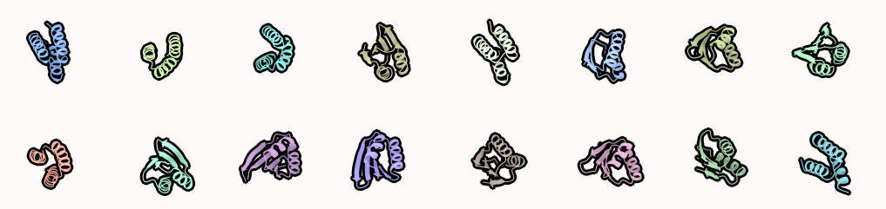

# Binder design
Binder design pipelines. Mostly still work in process..



## Round 1 - binder scaffold docking
Idea is to get get initial binder sequence, that binds to the target protein. 
If you dont care about where binders bind or want to explore prefered binding spots, start with `01a_binder_random_dock.ipynb`.
If you want to target specific residues, start with start with `01b_binder_dock.ipynb` for docking scaffolds (usually 3HB) or `01c_binder_dock.ipynb` for docking random scaffolds.

### 1a Random binder docking
In the `01a_binder_random_dock.ipynb` notebook, main thing you need to do is to change parameters, especailly path to `target_pdb`, `target_chain` and setup number of `iterations`.

Final command will look somewhat like this:  
```
sbatch --output=/dev/null --array=0-{scaf_num-1}%{array_lim} helper_scripts/predict_one_binder_random_loc.sh {target_pdb} {target_chain} {scaf_dir} {out_dir} {iterations} {designs_per_iteration} {proteinmpnn_per_input} {recycles} {sampling_temp}
```

- `target_pdb` - path to target pdb
- `target_chain` - name of target chain (can be multiple chains)
- `scaf_dir` - path to directory with binder scaffold pdbs
- `out_dir` - output directory
- `iterations` - number of iterations to perform when optimizing one binder (usually 10-15 is enough)
- `designs_per_iteration` - total number of (best) designs to go into next iteration as inputs (default: 10)
- `proteinmpnn_per_input` - total number of sequences to sample per input per iteration (default: 5)
- `recycles` - number of AF2 recycles (default: 12)
- `sampling_temp` - ProteinMPNN sampling temperature (default: 0.15)


### 1b RFdiffusion selected scaffold docking
In the `01b_binder_dock.ipynb` notebook, you need to setup `target_pdb` path and target protein`hotspots`, specify `scaffold_dir` (with/without backbone threading before ProteinMPNN) and a number of dockings (`num_of_diffusions`) to perform for each scaffold.

Final command:
```
sbatch --output=/dev/null --array=1-{array_number}%{array_limit} helper_scripts/binder_dock.sh {num_of_diffusions} {total_mpnn} {mpnn_per_design} {num_recycles} {sampling_temp} {scaffold_dir} {prefix} {target_pdb} {hotspots}
```

- `num_of_diffusions` - number of dockings to perform
- `total_mpnn` - total number of sequences for per design
- `mpnn_per_design` - total number of sequences to sample per design (filter from `total_mpnn`)
- `num_recycles` - number of AF2 recycles (default: 12)
- `sampling_temp` - ProteinMPNN sampling temperature (default: 0.15)
- `scaffold_dir` - path to directory with binder scaffolds ()
- `target_pdb` - path to target pdb
- `hotspots` - hotspot residues to target with binder (usually around 5)

> **Note:** If the Scaffold directory contains multiple subdirectories, the script will run each directory separately.


### 1c RFdiffusion random scaffold docking
WIP

## Round 2 - binder optimization
The idea of `02_binder_optimization.ipynb` notebook to get primary binders and optimize them with iterations of AF2 and ProteinMPNN, sorting by i_pae or some custom scoring function. Filter the binders and for each binder run an optimization script. Make sure to specify number of `iterations` and a way to `sort`.

Final command:
```
sbatch --output=/dev/null --array=0-{array_number-1}%{array_limit} helper_scripts/binder_opt.sh {binders_input} {output_dir} {iterations} {starting_mpnns} {designs_per_iteration} {mpnn_per_design} {sort} {af2_recycles} {mpnn_sampling_temp}
```

- `binders_input` - path to directory with input binder pdbs
- `output_dir` - output directory
- `iterations` - number of iterations per binder (10-15 is usually enough)
- `starting_mpnns` - number of sampled sequences from input binder
- `designs_per_iteration` - total number of (best) designs to go into next iteration as inputs (default: 10)
- `mpnn_per_design` - total number of sequences to sample per input per iteration (default: 5)
- `sort` - sort metrics between iterations (default: "i_pae")
- `af2_recycles` - number of AF2 recycles (default: 12)
- `mpnn_sampling_temp` - ProteinMPNN sampling temperature (default: 0.15)


## Round 3 - binder analysis
The idea of `03_binder_analysis.ipynb` notebook is to filter optimized sequences and calculate additional metrics, that would help use discriminate good binders from the bad ones. The notebook divides datasets into smaller chunks of 1000 and subsequently executes them individually on a cluster.

Final command:
```
sbatch --output=/dev/null --array=0-{array_number-1}%{array_limit} helper_scripts/binder_analysis.sh {input_file} {target_chain} {binder_chain} {metric_path}
```

- `input_file` - list of proteins to calculate metrics for (1000 per array job)
- `target_chain` - target chain
- `binder_chain` - binder chain
- `metric_path` - file for writing results (prepared with notebook)
- `xml_file` - rosetta xml file

## Round 4 - binder filtering and sequence clustering
The idea of `04_binder_filter.ipynb` notebook is to filter binders by different metrics, predict them again with AF2 and RF2 (and ESMfold), cluster similar sequences together and group final results.

Workflow:
- filter sequences based on the metrics from `03_binder_analysis.notebook` (i_pae, ddg_dsasa_100, charge, hyd_contacts, shape_comp, ...)
- validate sequences again with different prediciton methods (AlphaFold2, RoseTTAfold2, ESMfold)
```
sbatch --output=/dev/null --array=0-{array_number-1}%{array_limit} helper_scripts/predict_binders.sh {msa_folder} {output_path} {binder_analysis} {prediction_tools}
```
`msa_folder` - folder with input msa files \
`output_path` - output folder \
`binder_analysis` - flags for binder analysis (define if you want binder analysis and the position of binder - binder or binder-second) \
`prediction_tools` - prediction tools to use (colabfold, rosettafold2 or/and ...)

- second round of filtering, based on validation results (af2_plddt, af2_pae, af2_rmsd, ...)
- clustering similar sequences together and prepare final binder sequences to order