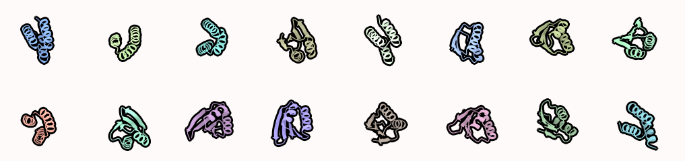

# Binder design
Binder design using partial diffusion

## Round 1 - binder scaffold docking
Idea is to get get initial binder sequence, that binds to the target protein. Start with `01_binder_scaffold_dock.ipynb` for docking scaffolds (usually 3HB)

## Round 2 - use partial diffusion to generate more diverse (designable) backbones
Use `02_partial_diff.ipynb` notebook to run partial diffusion on best hits from the first notebook
